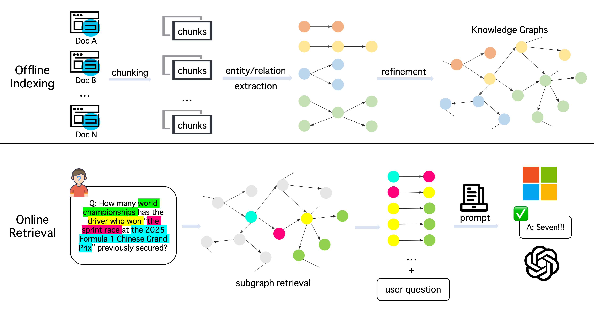

# Awesome GraphRAG

    
    

  This repository contains a curated list of resources on GraphRAG. 

    Continuously updating, stay tuned!

# Introduction
**Large language models (LLMs)** have demonstrated remarkable capabilities across diverse tasks, achieving significant advancements in text comprehension, question answering, and content generation. However, their performance in knowledge-intensive tasks, particularly those requiring domain expertise, remains suboptimal due to the folllowing limitations: their pretrained knowledge, though broad, lacks depth in specialized areas due to reliance on general-domain data, resulting in inconsistencies with current domain standards; they struggle with precise, multi-step reasoning required by domain-specific rules, often failing to maintain logical consistency and accuracy in complex reasoning chains; and they exhibit limited context sensitivity, frequently misinterpreting or oversimplifying domain-specific terms and concepts that vary meaning based on context.

**Retrieval-Augmented generation (RAG)** offers a promising solution to customize LLMs for specific domains. Rather than retraining LLMs to incorporate updates, RAG enhances these models by leveraging external knowledge from text corpora without modifying their architecture or parameters. This approach enables LLMs to generate responses by leveraging not only their pre-trained knowledge but also real-time retrieved domain-specific information, thereby providing more accurate and reliable answers. However, the practical effectiveness of RAG systems in real-world applications is hindered by limitations in complex query comprehension, difficulties in synthesizing distributed domain knowledge, inherent constraints of LLMs, and issues with system efficiency and scalability[1].

To address these limitations, **graph retrieval-augmented generation (GraphRAG)** has recently emerged as a new paradigm to customize LLMs with well-organized background knowledge and improved contextual reasoning. GraphRAG, formally defined as a specialized subclass of the RAG framework, utilizes graph structures to systematically organize and retrieve domain-specific knowledge. Its workflow encompasses two key stages: offline indexing and online retrieval. The overall pipeline is as follows.

We collect the recent influential papers and benchmarks about GraphRAG. The following contents are listed in chronological order of publication.

# 📑 Research Paper
|Date|Venue|Title|Code|Notes|
|:---:|:---:|:---:|:---:|:---:|
|2025-03-18|Arxiv|[KG-IRAG: A Knowledge Graph-Based Iterative Retrieval-Augmented Generation Framework for Temporal Reasoning](https://arxiv.org/abs/2503.14234)|No|*Graphs for Knowledge Indexing & Graphs as Knowledge Carrier(KG construction from corpus)*|
|2025-03-13|Arxiv|[Retrieval-Augmented Generation with Hierarchical Knowledge](https://arxiv.org/abs/2503.10150)|[Yes](https://github.com/hhy-huang/HiRAG)|*Graphs for Knowledge Indexing & Graphs as Knowledge Carrier(KG construction from corpus)*|
|2025-02-20|Arxiv|[(HippoRAG 2)From RAG to Memory: Non-Parametric Continual Learning for Large Language Models](https://arxiv.org/abs/2502.14802)|[Yes](https://github.com/OSU-NLP-Group/HippoRAG)|*Graphs for Knowledge Indexing & Graphs as Knowledge Carrier(KG construction from corpus)*|
|2025-02-14|Arxiv|[ArchRAG: Attributed Community-based Hierarchical Retrieval-Augmented Generation](https://arxiv.org/abs/2502.09891)|No|*Graphs for Knowledge Indexing & Graphs as Knowledge Carrier(KG construction from corpus)*|
|2025-02-08|NAACL 2025|[(KG2RAG)Knowledge Graph-Guided Retrieval Augmented Generation](https://arxiv.org/abs/2502.06864)|[Yes](https://github.com/nju-websoft/KG2RAG)|*Graphs for Knowledge Indexing & Graphs as Knowledge Carrier(KG construction from corpus)*|
|2025-02-06|The ACM Web Conference 2025|[MedRAG: Enhancing Retrieval-augmented Generation with Knowledge Graph-Elicited Reasoning for Healthcare Copilot](https://arxiv.org/abs/2502.04413)|[Yes](https://github.com/SNOWTEAM2023/MedRAG?tab=readme-ov-file)|*Graphs as Knowledge Carrier(KG construction from corpus)*|
|2024-12-17|Arxiv|[SimGRAG: Leveraging Similar Subgraphs for Knowledge Graphs Driven Retrieval-Augmented Generation](https://arxiv.org/abs/2412.15272)|[Yes](https://github.com/YZ-Cai/SimGRAG)|*Graphs as Knowledge Carrier(KG construction from corpus & with existing KGs)*|
|2024-10-28|ICLR 2025|[Simple Is Effective: The Roles of Graphs and Large Language Models in Knowledge-Graph-Based Retrieval-Augmented Generation](https://arxiv.org/abs/2410.20724)|[Yes](https://github.com/Graph-COM/SubgraphRAG)|*Graphs as Knowledge Carrier(KG construction from corpus)*|
|2024-10-08|Arxiv|[LightRAG: Simple and Fast Retrieval-Augmented Generation](https://arxiv.org/abs/2410.05779)|[Yes](https://github.com/HKUDS/LightRAG)|*Graphs as Knowledge Carrier(KG construction from corpus)*|
|2024-05-23|NeurIPS 2024|[HippoRAG: Neurobiologically Inspired Long-Term Memory for Large Language Models](https://arxiv.org/abs/2405.14831)|[Yes](https://github.com/OSU-NLP-Group/HippoRAG)|*Graphs as Knowledge Carrier(KG construction from corpus)*|
|2024-04-24|Arxiv|[From Local to Global: A Graph RAG Approach to Query-Focused Summarization](https://arxiv.org/abs/2404.16130)|[Yes](https://github.com/microsoft/graphrag)|*Graphs as Knowledge Carrier(Knowledge Graph Construction from Corpus)*|

# 🧐 Survey Papers
|Date|Venue|Title|Repo|
|:---:|:---:|:---:|:---:|
|2025-01-21|Arxiv|[A Survey of Graph Retrieval-Augmented Generation for Customized Large Language Models](https://arxiv.org/abs/2501.13958)|[Yes](https://github.com/DEEP-PolyU/Awesome-GraphRAG)|
|2024-12-31|Arxiv|[Retrieval-Augmented Generation with Graphs (GraphRAG)](https://arxiv.org/abs/2501.00309))|[Yes](https://github.com/Graph-RAG/GraphRAG/)|
|2024-08-15|Arxiv|[Graph Retrieval-Augmented Generation: A Survey](https://arxiv.org/abs/2408.08921)|[Yes](https://github.com/pengboci/GraphRAG-Survey)|
|2024-05-10|KDD 2024|[A Survey on RAG Meeting LLMs: Towards Retrieval-Augmented Large Language Models](https://arxiv.org/abs/2405.06211)|No|

# 🥇 Benchmark
|Dataset|Task|Info|Metrix|
|:---:|:---:|:---:|:---:|
|[NaturalQuestions](https://ai.google.com/research/NaturalQuestions)|Simple QA|A general-domain simple QA dataset based on the Wikipedia dump knowledge base, testing the model’s ability to extract answers from encyclopedia content.|EM, F1 Score|
|[PopQA](https://huggingface.co/datasets/akariasai/PopQA)|Simple QA|A general simple QA dataset relying on Wikipedia dump knowledge, focusing on daily question-answering handling.|Accuracy, F1 Score|
|[SimpleQuestion](https://huggingface.co/datasets/fbougares/simple_questions_v2/tree/main)|Simple QA|A general simple factual QA dataset completing entity-relationship QA via the Freebase knowledge base.|Entity Linking Accuracy, Triple Match Rate|
|[WebQ](https://huggingface.co/datasets/Stanford/web_questions)|Simple QA|A general simple QA dataset using Freebase knowledge for factual QA on web questions.|Precision, Recall|
|[WebQSP](https://www.microsoft.com/en-us/download/details.aspx?id=52763)|Simple QA|A general simple QA dataset finishing semantic parsing and QA tasks based on Freebase.|EM|
|[MuSiQue](https://github.com/StonyBrookNLP/musique)|Multi-hop QA|A general multi-hop QA dataset with implicit in-data knowledge, testing multi-step reasoning ability.|Accuracy|
|[2WikiMultihopQA](https://github.com/Alab-NII/2wikimultihop)|Multi-hop QA|A general multi-hop QA dataset with in-data implicit knowledge, emphasizing cross-Wikipedia paragraph reasoning.|EM, F1 Score|
|[HotpotQA](https://hotpotqa.github.io/)|Multi-hop QA|A general multi-hop QA dataset completing multi-hop reasoning QA based on Wikipedia dump.|EM, F1 Score|
|[CWQ](https://huggingface.co/datasets/drt/complex_web_questions)|Multi-hop QA|A general multi-hop QA dataset handling complex relationship reasoning QA via Freebase.|Accuracy|
|[MultiHop-RAG](https://github.com/yixuantt/MultiHop-RAG/)|Multi-hop QA|A Dataset for Evaluating Retrieval-Augmented Generation Across Documents.|Hits@10, Hits@4, MAP@10, MRR@10|
|[MetaQA](https://github.com/yuyuz/MetaQA)|Multi-hop QA|A movie-domain multi-hop QA dataset relying on the in-data movie knowledge base for reasoning.|Accuracy|
|[Mintaka](https://huggingface.co/datasets/AmazonScience/mintaka)|Complex QA|A general complex QA dataset handling complex knowledge association QA based on Wikidata.|EM|
|[GrailQA](https://dki-lab.github.io/GrailQA/)|Complex QA|A general complex QA dataset testing complex semantic parsing and knowledge reasoning via Freebase.|Accuracy|
|[UltraDomain](https://huggingface.co/datasets/TommyChien/UltraDomain)|Complex QA|An 18-domain complex QA dataset testing cross-domain complex question-handling ability.|LLM as judger, like GraphRAG & LightRAG|
|[TriviaQA](https://huggingface.co/datasets/mandarjoshi/trivia_qa)|Complex QA|A general complex QA dataset without explicit external knowledge, focusing on open-domain complex QA.|Accuracy|
|[LC-QuAD v2](https://huggingface.co/datasets/mohnish/lc_quad)|Large-scale Complex QA|A general large-scale complex QA dataset handling large-scale knowledge QA based on Wikidata/DBpedia.|EM|
|[KQAPro](https://huggingface.co/datasets/drt/kqa_pro)|Large-scale Complex QA|A large-scale dataset of complex question answering over Wikidata. The questions are very diverse and challenging, requiring multiple reasoning capabilities including compositional reasoning, multi-hop reasoning, quantitative comparison, set operations, and etc.|Accuracy|
|[FACTKG](https://github.com/jiho283/FactKG?tab=readme-ov-file)|Fact Verification|Fact Verification via Reasoning on Knowledge Graphs. It consists of 108k natural language claims with five types of reasoning: One-hop, Conjunction, Existence, Multi-hop, and Negation based on DBpedia.|Accuracy|
|[DDXPlus](https://github.com/mila-iqia/ddxplus)|Medical QA & Diagnostic support|A new large-scale dataset for Automatic Symptom Detection (ASD) and Automatic Diagnosis (AD) systems in the medical domain.|IL (Interaction Length), GTPA (Ground Truth Probability Above Threshold), DDR/DDP/DDF1 (Differential Diagnosis Recall/Precision/F1), DSP/DSR/DSF1 (Severity Precision/Recall/F1)|
|[NarrativeQA](https://huggingface.co/datasets/deepmind/narrativeqa)|QA & **Discourse Understanding**|An English-lanaguage dataset of stories and corresponding questions designed to test reading comprehension, especially on long documents.|F1|

# 📊 Existing Knowledge Graphs
|Date|Venue|Title|Homepage|Domain|
|:------:|:---:|:---:|:---:|:---:|
|2023-08-23|SIGIR 2024|[YAGO 4.5: A Large and Clean Knowledge Base with a Rich Taxonomy](https://arxiv.org/abs/2308.11884)|[Yes](https://yago-knowledge.org/)|General|
|2023-02-09|Bioinformatics|[The scalable precision medicine open knowledge engine (spoke): a massive knowledge graph of biomedical information](https://academic.oup.com/bioinformatics/article/39/2/btad080/7033465?login=false)|[Yes](https://spoke.ucsf.edu/)|Biomedical|
|2018-11-22|Nucleic acids research|[String v11: protein–protein association networks with increased coverage, supporting functional discovery in genome-wide experimental datasets](https://academic.oup.com/nar/article/47/D1/D607/5198476?login=false)|[Yes](https://string-db.org/)|Protein-protein interaction prediction|
|2018-05-12|LREC workshop|[Lynx: building the legal knowledge graph for smart compliance services in multilingual europe](http://lrec-conf.org/workshops/lrec2018/W22/pdf/12_W22.pdf)|[Yes](https://lynx-project.eu/)|Legal|

# ✅ Citation
[1] A Survey of Graph Retrieval-Augmented Generation  for Customized Large Language Models. 
