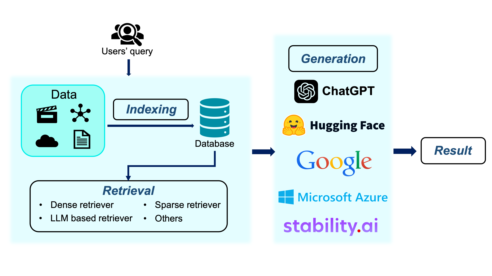

# Awesome RAG Papers
This is a repo contains a list of papers about RAG, especially RAG with Knowledge Graphs

# Introduction
**Large language models (LLMs)** have demonstrated impressive reasoning abilities in complex tasks. However, they lack up-to-date knowledge and experience hallucinations during reasoning, which can lead to incorrect reasoning processes and diminish their performance and trustworthiness.

Recently, **Retrieval-Augmented Generation (RAG)** has achieved remarkable success in addressing the challenges of LLMs without necessitating retraining. By referencing an external knowledge base, RAG refines LLM outputs, effectively mitigating issues such as “hallucination”, lack of domain-specific knowledge, and outdated information. But in some practical scenarios, traditional RAG fails to capture significant structured relational knowledge, often recounts content in the form of text when concatenated as prompts and fails to grasp global information comprehensively.

Combining RAG with **Knowledge Graphs (KGs)** emerges as a promising solution to address these challenges. KGs can offer a structured and explicit representation of entities and relationships that are more accurate than retrieving information through vector similarity. Leveraging external structured knowledge graphs can improve contextual understanding of LLMs and generate more informed responses. The entire process typically contains three stages: Indexing, Retrieval and Generation. The overall pipeline is as follows.

We collect the recent influential papers about RAG especially RAG with KGs. The following papers are listed in chronological order of publication.

# Paper List
## 2024
|Date|Venue|Title|Code|Description|
|:-----:|:------:|:------------:|:----:|:-----:|
|2024-10-28|Arxiv|[Simple is Effective: The Roles of Graphs and Large Language Models in Knowledge-Graph-Based Retrieval-Augmented Generation](https://arxiv.org/abs/2410.20724)|[Yes](https://github.com/graph-com/subgraphrag)|*This paper introduce the SubgraphRAG, extending the KG-based RAG framework that retrieves subgraphs and leverages LLMs for reasoning and answer prediction. It integrates a lightweight multilayer perceptron with a parallel triple-scoring mechanism for efficient and flexible subgraph retrieval while encoding directional structural distances to enhance retrieval effectiveness.*|
|2024-10-23|Arxiv|[Graphusion: A RAG Framework for Knowledge Graph Construction with a Global Perspective](https://arxiv.org/abs/2410.17600)|No|*This work introduces Graphusion, a zero-shot KGC framework from free text. It contains three steps: in Step 1, extract a list of seed entities using topic modeling to guide the final KG includes the most relevant entities; in Step 2, conduct candidate triplet extraction using LLMs; in Step 3, design the novel fusion module that provides a global view of the extracted knowledge, incorporating entity merging, conflict resolution, and novel triplet discovery.*|
|2024-10-08|Arxiv|[LightRAG: Simple and Fast Retrieval-Augmented Generation](https://arxiv.org/abs/2410.05779)|[Yes](https://github.com/HKUDS/LightRAG)|*This paper proposes a system that integrates graph structures into text indexing and retrieval to address the limitations of existing RAG systems in handling complex interdependencies between entities. The system includes an incremental update algorithm to ensure timely integration of new data, keeping the system effective in rapidly changing data environments.*|
| 2024-08-15 | Arxiv | [Graph Retrieval-Augmented Generation: A Survey](https://arxiv.org/abs/2408.08921)| No |*This paper provides an overview of GraphRAG, a methodology that enhances language models by integrating knowledge graphs to improve retrieval accuracy and contextual responses. It details the GraphRAG workflow, from indexing to retrieval and generation, and discusses its applications and future research directions, highlighting its potential across various domains.*|
|2024-08-09|Arxiv|[HybridRAG: Integrating Knowledge Graphs and Vector Retrieval Augmented Generation for Efficient Information Extraction](https://arxiv.org/abs/2408.04948)|No|*HybridRAG combines the Knowledge Graphs (KGs) based RAG techniques (called GraphRAG) and VectorRAG techniques to enhance question-answer (Q&A) systems for information extraction from financial documents that is shown to be capable of generating accurate and contextually relevant answers.*|
|2024-07-20|Arxiv|[Golden-Retriever: High-Fidelity Agentic Retrieval Augmented Generation for Industrial Knowledge Base](https://arxiv.org/abs/2408.00798)|No|*Golden-Retriever incorporates a reflection-based question augmentation step before document retrieval, which involves identifying jargon, clarifying its meaning based on context, and augmenting the question accordingly.*|
|2024-05-26|Arxiv|[GRAG: Graph Retrieval-Augmented Generation](https://arxiv.org/abs/2405.16506)|No|*GRAG tackles the fundamental challenges in retrieving textual subgraphs and integrating the joint textual and topological information into Large Language Models (LLMs) to enhance its generation.*|
|2024-05-23|Arxiv|[HippoRAG: Neurobiologically Inspired Long-Term Memory for Large Language Models](https://arxiv.org/abs/2405.14831)|[Yes](https://github.com/OSU-NLP-Group/HippoRAG)|*HippoRAG is a novel retrieval framework inspired by the hippocampal indexing theory of human long-term memory to enable deeper and more efficient knowledge integration over new experiences. HippoRAG synergistically orchestrates LLMs, knowledge graphs, and the Personalized PageRank algorithm to mimic the different roles of neocortex and hippocampus in human memory.*|
|2024-05-20|Arxiv|[KG-RAG: Bridging the Gap Between Knowledge and Creativity](https://arxiv.org/abs/2405.12035)|[Yes](https://github.com/BaranziniLab/KG_RAG)|*KG-RAG is a novel framework designed to enhance the knowledge capabilities of LMAs by integrating structured Knowledge Graphs (KGs) with the functionalities of LLMs, thereby significantly reducing the reliance on the latent knowledge of LLMs.*|
|2024-05-13|Arxiv|[Evaluation of Retrieval-Augmented Generation: A Survey](https://arxiv.org/abs/2405.07437)|[Yes](https://github.com/yhpeter/awesome-rag-evaluation)|*This paper examine and compare several quantifiable metrics of the Retrieval and Generation components, such as relevance, accuracy, and faithfulness, within the current RAG benchmarks, encompassing the possible output and ground truth pairs. The paper also analyze the various datasets and metrics, discuss the limitations of current benchmarks, and suggest potential directions to advance the field of RAG benchmarks.*|
|2024-05-10|KDD 24|[A Survey on RAG Meeting LLMs: Towards Retrieval-Augmented Large Language Models](https://arxiv.org/abs/2405.06211)|No|*This survey comprehensively review existing research studies in RA-LLMs, covering three primary technical perspectives: architectures, training strategies, and applications. As the preliminary knowledge, the authors briefly introduce the foundations and recent advances of LLMs. Then, to illustrate the practical significance of RAG for LLMs, the authors systematically review mainstream relevant work by their architectures, training strategies, and application areas, detailing specifically the challenges of each and the corresponding capabilities of RA-LLMs. Finally, to deliver deeper insights, the authors discuss current limitations and several promising directions for future research.*|
|2024-05-08|EMNLP 2024|[DALK: Dynamic Co-Augmentation of LLMs and KG to answer Alzheimer's Disease Questions with Scientific Literature](https://arxiv.org/abs/2405.04819)|[Yes](https://github.com/david-li0406/dalk)|*The purpose of DALK is to address this limitation and demonstrate its ability on studying Alzheimer's Disease (AD), a specialized sub-field in biomedicine and a global health priority*|
|2024-04-26|SIGIR 2024|[Retrieval-Augmented Generation with Knowledge Graphs for Customer Service Question Answering](https://arxiv.org/abs/2404.17723)|No|*This paper introduce a novel customer service question-answering method that amalgamates RAG with a knowledge graph (KG).*|
|2024-04-24|Arxiv|[From Local to Global: A Graph RAG Approach to Query-Focused Summarization](https://arxiv.org/abs/2404.16130)|[Yes](https://github.com/microsoft/graphrag)|*This paper propose a two-stage approach using a large language model (LLM) to build a graph-based text index: first, deriving an entity knowledge graph from source documents, and second, pre-generating community summaries for closely-related entities. When a question is posed, each community summary generates a partial response, which are then summarized into a final user response.*|
|2024-04-10|Arxiv|[Graph Chain-of-Thought: Augmenting Large Language Models by Reasoning on Graphs](https://arxiv.org/abs/2404.07103)|[Yes](https://github.com/PeterGriffinJin/Graph-CoT)|*This paper construct a Graph Reasoning Benchmark dataset called GRBench, containing 1,740 questions that can be answered with the knowledge from 10 domain graphs. Then, the authors propose a simple and effective framework called Graph Chain-of-thought (Graph-CoT) to augment LLMs with graphs by encouraging LLMs to reason on the graph iteratively.*|
|2024-03-09|Arxiv|[KG-Rank: Enhancing Large Language Models for Medical QA with Knowledge Graphs and Ranking Techniques](https://arxiv.org/abs/2403.05881)|[Yes](https://github.com/yangrui525/kg-rank)|*KG-Rank leverages a medical knowledge graph (KG) along with ranking and re-ranking techniques to improve the factuality of long-form question answering (QA) in the medical domain.*|
|2024-02-19|Arxiv|[Graph-Based Retriever Captures the Long Tail of Biomedical Knowledge](https://arxiv.org/abs/2402.12352)|No|*This paper introduce a novel information-retrieval method that leverages a knowledge graph to downsample these clusters and mitigate the information overload problem. Its retrieval performance is about twice better than embedding similarity alternatives on both precision and recall.*|
|2024-02-12|Arxiv|[G-Retriever: Retrieval-Augmented Generation for Textual Graph Understanding and Question Answering](https://arxiv.org/abs/2402.07630)|[Yes](https://github.com/xiaoxinhe/g-retriever)|*G-Retriever is a method designed for textual graph understanding and question answering. It enables users to interact with a graph through a conversational interface, asking questions and receiving textual replies along with highlighted relevant parts of the graph. The approach integrates Graph Neural Networks (GNNs), Large Language Models (LLMs), and Retrieval-Augmented Generation (RAG) to enhance understanding of graphs through soft prompting.*|
|2024-02-06|ICML 24|[DFA-RAG: Conversational Semantic Router for Large Language Model with Definite Finite Automaton](https://arxiv.org/abs/2402.04411)|No|*DFA-RAG is a novel framework designed to enhance the capabilities of conversational agents using large language models (LLMs).*|

## 2023
|Date|Venue|Title|Code|Description|
|:-----:|:------:|:------------:|:----:|:-----:|
|2023-12-18|Arxiv|[Retrieval-Augmented Generation for Large Language Models: A Survey](https://arxiv.org/abs/2312.10997)|No|*The survey outlines the evolution of RAG through three paradigms: Naive RAG, Advanced RAG, and Modular RAG. It meticulously examines the three foundational components of RAG frameworks, which include retrieval, generation, and augmentation techniques. The paper highlights the state-of-the-art technologies embedded in each of these components, offering a profound understanding of the advancements in RAG systems.*|
|2023-12-11|Arxiv|[KnowGPT: Knowledge Graph based Prompting for Large Language Models](https://arxiv.org/abs/2312.06185)|No|*This paper introduce a novel Knowledge Graph based PrompTing framework, namely KnowGPT, to enhance LLMs with domain knowledge. KnowGPT contains a knowledge extraction module to extract the most informative knowledge from KGs, and a context-aware prompt construction module to automatically convert extracted knowledge into effective prompts.*|
|2023-12-05|Arxiv|[Large Language Models on Graphs: A Comprehensive Survey](https://arxiv.org/abs/2312.02783)|No|*This paper provide a systematic review of scenarios and techniques related to large language models on graphs.*|
|2023-10-17|ICLR 24|[Self-RAG: Learning to Retrieve, Generate, and Critique through Self-Reflection](https://arxiv.org/abs/2310.11511)|[Yes](https://github.com/AkariAsai/self-rag)|*The framework trains a single arbitrary LM that adaptively retrieves passages on-demand, and generates and reflects on retrieved passages and its own generations using special tokens, called reflection tokens. Generating reflection tokens makes the LM controllable during the inference phase, enabling it to tailor its behavior to diverse task requirements.*|

## Benchmark
|Date|Venue|Title|Code|Description|
|:-----:|:------:|:------------:|:----:|:-----:|
|2024-04-10|Arxiv|[Graph Chain-of-Thought: Augmenting Large Language Models by Reasoning on Graphs](https://arxiv.org/abs/2404.07103)|[Yes](https://github.com/PeterGriffinJin/Graph-CoT)|*This paper construct a Graph Reasoning Benchmark dataset called GRBench, containing 1,740 questions that can be answered with the knowledge from 10 domain graphs.*|
|2024-06-07|NeurIPS 2024|[CRAG -- Comprehensive RAG Benchmark](https://arxiv.org/abs/2406.04744)|[Yes](https://github.com/facebookresearch/crag)|*CRAG is designed to encapsulate a diverse array of questions across five domains and eight question categories, reflecting varied entity popularity from popular to long-tail, and temporal dynamisms ranging from years to seconds*|
