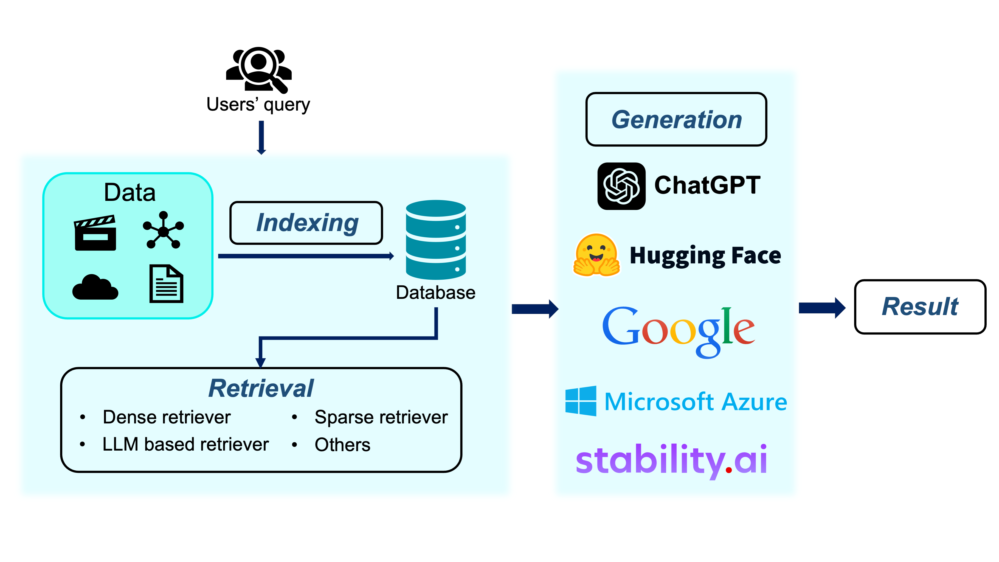

# Awesome GraphRAG
This is a repo contains a list of papers about RAG, especially RAG with Knowledge Graphs

# Introduction
**Large language models (LLMs)** have demonstrated impressive reasoning abilities in complex tasks. However, they lack up-to-date knowledge and experience hallucinations during reasoning, which can lead to incorrect reasoning processes and diminish their performance and trustworthiness.

Recently, **Retrieval-Augmented Generation (RAG)** has achieved remarkable success in addressing the challenges of LLMs without necessitating retraining. By referencing an external knowledge base, RAG refines LLM outputs, effectively mitigating issues such as “hallucination”, lack of domain-specific knowledge, and outdated information. But in some practical scenarios, traditional RAG fails to capture significant structured relational knowledge, often recounts content in the form of text when concatenated as prompts and fails to grasp global information comprehensively.

Combining RAG with **Knowledge Graphs (KGs)** emerges as a promising solution to address these challenges. KGs can offer a structured and explicit representation of entities and relationships that are more accurate than retrieving information through vector similarity. Leveraging external structured knowledge graphs can improve contextual understanding of LLMs and generate more informed responses. The entire process typically contains three stages: Indexing, Retrieval and Generation. The overall pipeline is as follows.

We collect the recent influential papers about RAG especially RAG with KGs. The following papers are listed in chronological order of publication.

# 📑 Research Paper
|Date|Venue|Title|Code|Category|
|:---:|:---:|:---:|:---:|:---:|
|2025-02-08|NAACL 2025|[Knowledge Graph-Guided Retrieval Augmented Generation](https://arxiv.org/abs/2502.06864)|[Yes](https://github.com/nju-websoft/KG2RAG)|Graphs for Knowledge Indexing & Graphs as Knowledge Carrier|
|2025-02-06|The ACM Web Conference 2025|[MedRAG: Enhancing Retrieval-augmented Generation with Knowledge Graph-Elicited Reasoning for Healthcare Copilot](https://arxiv.org/abs/2502.04413)|[Yes](https://github.com/SNOWTEAM2023/MedRAG?tab=readme-ov-file)||
|2024-12-17|Arxiv|[SimGRAG: Leveraging Similar Subgraphs for Knowledge Graphs Driven Retrieval-Augmented Generation](https://arxiv.org/abs/2412.15272)|[Yes](https://github.com/YZ-Cai/SimGRAG)||
|2024-10-28|ICLR 2025|[Simple Is Effective: The Roles of Graphs and Large Language Models in Knowledge-Graph-Based Retrieval-Augmented Generation](https://arxiv.org/abs/2410.20724)|[Yes](https://github.com/Graph-COM/SubgraphRAG)||
|2024-10-08|Arxiv|[LightRAG: Simple and Fast Retrieval-Augmented Generation](https://arxiv.org/abs/2410.05779)|[Yes](https://github.com/HKUDS/LightRAG)||
|2024-05-23|NeurIPS 2024|[HippoRAG: Neurobiologically Inspired Long-Term Memory for Large Language Models](https://arxiv.org/abs/2405.14831)|[Yes](https://github.com/OSU-NLP-Group/HippoRAG)||
|2024-04-24|Arxiv|[From Local to Global: A Graph RAG Approach to Query-Focused Summarization](https://arxiv.org/abs/2404.16130)|[Yes](https://github.com/microsoft/graphrag)|*Graphs as Knowledge Carrier &   Knowledge Graph Construction from Corpus*|

# 🧐 Survey Papers
|Date|Venue|Title|Repo|
|:---:|:---:|:---:|:---:|
|2024-12-31|Arxiv|[Retrieval-Augmented Generation with Graphs (GraphRAG)](https://arxiv.org/abs/2501.00309))|[Yes](https://github.com/Graph-RAG/GraphRAG/)|
|2024-08-15|Arxiv|[Graph Retrieval-Augmented Generation: A Survey](https://arxiv.org/abs/2408.08921)|[Yes](https://github.com/pengboci/GraphRAG-Survey)|
|2024-05-10|KDD 2024|[A Survey on RAG Meeting LLMs: Towards Retrieval-Augmented Large Language Models](https://arxiv.org/abs/2405.06211)|No|

# 🥇 Benchmark
|Domain|Task|Dataset|Background Knowledge|
|:---:|:---:|:---:|:---:|
|General|Simple QA|[SimpleQuestion](https://huggingface.co/datasets/fbougares/simple_questions_v2/tree/main)|[Freebase](https://developers.google.com/freebase/)|
|General|Simple QA|[WebQ](https://huggingface.co/datasets/Stanford/web_questions)|[Freebase](https://developers.google.com/freebase/)|
|General|Simple QA|[WebQSP](https://www.microsoft.com/en-us/download/details.aspx?id=52763)|[Freebase](https://developers.google.com/freebase/)|
|General|Multi-hop Reasoning|[CWQ](https://huggingface.co/datasets/drt/complex_web_questions)|[Freebase](https://developers.google.com/freebase/)|
|Movie|Multi-hop Reasoning|[MetaQA](https://github.com/yuyuz/MetaQA)|Movie knowledge base(inclued in dataset)|
|General|Multi-hop Reasoning|[MultiHop-RAG](https://github.com/yixuantt/MultiHop-RAG/)|-|
|General|Large-scale Complex QA|[LC-QuAD v2](https://huggingface.co/datasets/mohnish/lc_quad)|[Wikidata](https://research.google/pubs/wikidata-a-free-collaborative-knowledge-base/) or [DBpedia](https://www.dbpedia.org/)|
|General|Large-scale Complex QA|[KQAPro](https://huggingface.co/datasets/drt/kqa_pro)|[Wikidata](https://research.google/pubs/wikidata-a-free-collaborative-knowledge-base/)|
|General|Complex QA|[Mintaka](https://huggingface.co/datasets/AmazonScience/mintaka)|[Wikidata](https://research.google/pubs/wikidata-a-free-collaborative-knowledge-base/)|
|General|Complex QA|[GrailQA](https://dki-lab.github.io/GrailQA/)|[Freebase](https://developers.google.com/freebase/)|
|18 domains|Complex QA|[UltraDomain](https://huggingface.co/datasets/TommyChien/UltraDomain)|-|
|General|Fact Verification|[FACTKG](https://github.com/jiho283/FactKG?tab=readme-ov-file)|[DBpedia](https://www.dbpedia.org/)|
|General|Multi-hop QA|[HotpotQA](https://hotpotqa.github.io/)|Wikipedia|
|Medical|Medical QA & Diagnostic support|[DDXPlus](https://github.com/mila-iqia/ddxplus)|-|

# 📊 Existing Knowledge Graphs
|Date|Venue|Title|Homepage|Domain|
|:------:|:---:|:---:|:---:|:---:|
|2023-08-23|SIGIR 2024|[YAGO 4.5: A Large and Clean Knowledge Base with a Rich Taxonomy](https://arxiv.org/abs/2308.11884)|[Yes](https://yago-knowledge.org/)|General|
|2023-02-09|Bioinformatics|[The scalable precision medicine open knowledge engine (spoke): a massive knowledge graph of biomedical information](https://academic.oup.com/bioinformatics/article/39/2/btad080/7033465?login=false)|[Yes](https://spoke.ucsf.edu/)|Biomedical|
|2018-11-22|Nucleic acids research|[String v11: protein–protein association networks with increased coverage, supporting functional discovery in genome-wide experimental datasets](https://academic.oup.com/nar/article/47/D1/D607/5198476?login=false)|[Yes](https://string-db.org/)|Protein-protein interaction prediction|
|2018-05-12|LREC workshop|[Lynx: building the legal knowledge graph for smart compliance services in multilingual europe](http://lrec-conf.org/workshops/lrec2018/W22/pdf/12_W22.pdf)|[Yes](https://lynx-project.eu/)|Legal|
